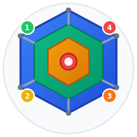

<div align="center">



# InduForm

### Industrial Terraform for OT Network Security

**Declarative IEC 62443 zone/conduit modeling, validation, and compliance for operational technology networks**

[](https://github.com/mniedermaier/InduForm/actions/workflows/ci.yml)
[](https://github.com/mniedermaier/InduForm)
[](https://python.org)
[](https://typescriptlang.org)
[](https://react.dev)
[](https://fastapi.tiangolo.com)
[](LICENSE)

[Getting Started](#-quick-start) &bull; [Screenshots](#-screenshots) &bull; [Features](#-features) &bull; [Documentation](#-configuration) &bull; [Contributing](#-contributing)

</div>

---

<div align="center">


*Visual zone/conduit topology editor with real-time IEC 62443 compliance validation*

</div>

---

## Why InduForm?

Designing and maintaining IEC 62443-compliant OT network architectures is complex. Most teams rely on Visio diagrams and spreadsheets that drift out of sync, lack validation, and can't generate actionable outputs.

**InduForm treats your OT security architecture as code.** Define zones, conduits, and assets visually or in YAML, and InduForm continuously validates them against IEC 62443 policies, generates firewall rules, VLAN mappings, and compliance reports -- all in real-time.

> *Think Terraform, but for industrial network security zones and conduits.*

---

## Screenshots

<table>
<tr>
<td width="50%">


**Login Page** -- Animated 3D network background with secure authentication

</td>
<td width="50%">


**Projects Dashboard** -- At-a-glance stats: zones, conduits, assets, compliance scores

</td>
</tr>
<tr>
<td width="50%">


**Topology Editor** -- Drag-and-drop zones with automatic conduit routing and policy validation

</td>
<td width="50%">


**Zone Properties** -- Edit zone details, view assets, and see compliance issues per zone

</td>
</tr>
</table>

---

## Quick Start

```bash
# Clone and start with Docker
git clone https://github.com/mniedermaier/InduForm.git
cd InduForm
docker compose up -d

# Open http://localhost:8081 in your browser
```

That's it. Register an account and start building your OT security architecture.

---

## Features

<table>
<tr>
<td width="50%">

### Visual Editor
Drag-and-drop zone/conduit topology editor built on React Flow. Color-coded zone types, security level badges, conduit routing with protocol flow labels, and real-time validation feedback.

### IEC 62443 Compliance
Built-in policy engine validates your architecture against IEC 62443-3-3 requirements in real-time. See violations and warnings as you design, with one-click quick fixes.

### Code Generation
Generate firewall rules (iptables/JSON), VLAN mappings (CSV/Cisco), and compliance reports (Markdown/PDF) directly from your architecture definition.

</td>
<td width="50%">

### Multi-User Collaboration
Teams with role-based access (Owner/Editor/Viewer), real-time presence with live cursor tracking, threaded comments on zones and conduits, and full version history with rollback.

### Import / Export
YAML project serialization, CSV bulk import for zones and assets, Nmap scan import for auto-discovery, PDF report generation for audits, and reusable templates.

### REST API & CLI
Full REST API with OpenAPI docs for CI/CD integration. WebSocket support for real-time updates. CLI for headless validation, policy checking, and code generation.

</td>
</tr>
</table>

### Policy Engine

InduForm continuously enforces these IEC 62443 security policies:

| Rule | What It Checks |
|------|---------------|
| **Default Deny** | All traffic must be explicitly allowed via conduits |
| **SL Boundary Protection** | Conduits spanning SL difference >= 2 require deep packet inspection |
| **Protocol Allowlist** | Only approved industrial protocols (OPC UA, Modbus, etc.) are permitted |
| **Cell Zone Isolation** | Cell zones must not have direct connectivity to each other |
| **DMZ Requirement** | Enterprise-to-cell traffic must traverse a DMZ |
| **Safety Zone Protection** | Safety zones require SL-T >= 3 with limited connectivity |

### Risk Assessment

Automated risk scoring based on security levels, asset criticality, zone types, and conduit configurations. Compliance percentages are calculated per-project and displayed in the dashboard.

---

## Installation

### Docker Compose (Recommended)

```bash
docker compose up -d                    # Start on http://localhost:8081
docker compose logs -f                  # View logs
docker compose down                     # Stop

# Rebuild after code changes
docker rm -f induform && docker compose build && docker compose up -d
```

### Development Setup

```bash
# Backend
python3 -m venv .venv && source .venv/bin/activate
pip install -e ".[dev]"
induform db init
induform serve --reload --port 8080     # API on http://localhost:8080

# Frontend (separate terminal)
cd web && npm install && npm run dev    # Vite dev server on http://localhost:5173
```

### Dev Mode with Hot Reload

```bash
docker compose --profile dev up induform-dev  # Mounts src/ and web/src/ for live editing
```

---

## Configuration

### Project YAML Format

Projects can be defined, exported, and imported as YAML:

```yaml
version: "1.0"
project:
  name: "Manufacturing Plant Alpha"
  description: "Automotive manufacturing facility"
  standard: "IEC62443"

zones:
  - id: enterprise
    name: "Enterprise Network"
    type: enterprise
    security_level_target: 1

  - id: dmz
    name: "Industrial DMZ"
    type: dmz
    security_level_target: 3
    assets:
      - id: historian
        name: "Process Historian"
        type: historian
        ip_address: "10.1.1.10"

  - id: cell_01
    name: "Assembly Cell 01"
    type: cell
    security_level_target: 2
    assets:
      - id: plc_01
        name: "Assembly PLC"
        type: plc
        ip_address: "10.10.1.10"

conduits:
  - id: cell_to_dmz
    from_zone: cell_01
    to_zone: dmz
    flows:
      - protocol: opcua
        port: 4840
        direction: outbound
```

### Zone Types

| Type | Description | Typical SL-T |
|------|-------------|:------------:|
| `enterprise` | Corporate IT network | 1 |
| `site` | Site-wide supervisory systems | 2 |
| `dmz` | Demilitarized zone | 3 |
| `area` | Area supervisory control | 2 |
| `cell` | Basic control zone | 2-3 |
| `safety` | Safety instrumented systems | 3-4 |

### Security Levels (SL-T)

| Level | Protection Against |
|:-----:|-------------------|
| **SL 1** | Casual or coincidental violation |
| **SL 2** | Intentional violation using simple means |
| **SL 3** | Sophisticated attack with moderate resources |
| **SL 4** | State-sponsored attack with extensive resources |

<details>
<summary><strong>Asset Types</strong></summary>

| Type | Description |
|------|-------------|
| `plc` | Programmable Logic Controller |
| `hmi` | Human Machine Interface |
| `scada` | SCADA Server |
| `engineering_workstation` | Engineering Workstation |
| `historian` | Data Historian |
| `jump_host` | Secure Access Jump Host |
| `firewall` | Firewall |
| `switch` | Network Switch |
| `router` | Router |
| `server` | General Server |
| `rtu` | Remote Terminal Unit |
| `ied` | Intelligent Electronic Device |
| `dcs` | Distributed Control System |
| `other` | Other Device |

</details>

---

## CLI

```bash
induform init [--name NAME]                      # Create starter YAML project
induform validate [CONFIG]                        # Validate against schema + policies
induform generate firewall|vlan|report [OPTIONS]  # Generate outputs
induform policies [CONFIG]                        # Check IEC 62443 policy rules
induform schema --model project|zone|conduit      # Export JSON Schema

induform db init|migrate|backup|status            # Database management
induform serve [--port PORT] [--host HOST]        # Start web server
```

---

## API

When running the server, interactive API docs are available at:
- **Swagger UI**: http://localhost:8080/docs
- **ReDoc**: http://localhost:8080/redoc

<details>
<summary><strong>Key Endpoints</strong></summary>

| Method | Endpoint | Description |
|:------:|----------|-------------|
| `POST` | `/api/auth/register` | Register new user |
| `POST` | `/api/auth/login` | Login |
| `GET` | `/api/projects/` | List projects |
| `POST` | `/api/projects/` | Create project |
| `GET` | `/api/projects/{id}` | Get project |
| `PUT` | `/api/projects/{id}` | Update project |
| `DELETE` | `/api/projects/{id}` | Delete project |
| `POST` | `/api/projects/{id}/access` | Share project |
| `GET` | `/api/projects/{id}/versions/` | List version history |
| `POST` | `/api/projects/{id}/versions/{v}/restore` | Restore version |
| `GET` | `/api/templates/` | List templates |
| `POST` | `/api/teams/` | Create team |
| `WS` | `/ws/projects/{id}` | Real-time collaboration |

</details>

---

## Technology Stack

| Layer | Technologies |
|-------|-------------|
| **Backend** | Python 3.11+, FastAPI, SQLAlchemy 2.0 (async), Pydantic v2 |
| **Database** | SQLite (aiosqlite) / PostgreSQL (asyncpg) |
| **Auth** | JWT access/refresh tokens, bcrypt password hashing |
| **Frontend** | React 18, TypeScript, Vite, Tailwind CSS |
| **Diagramming** | React Flow (@xyflow/react), Three.js (@react-three/fiber) |
| **Real-time** | WebSocket with presence and cursor tracking |
| **Reports** | ReportLab (PDF), Markdown, JSON, CSV |

---

## Development

### CI/CD

GitHub Actions runs on every push and PR to `main` with two parallel jobs:
- **Backend**: ruff lint + format check, mypy type check, pytest with coverage
- **Frontend**: ESLint, TypeScript type check, Vitest tests, production build

### Running Tests

```bash
# Backend
pytest tests/
pytest tests/ --cov=induform --cov-report=html

# Frontend
cd web && npm run test
cd web && npm run test:watch
```

### Linting & Type Checking

```bash
# Backend
ruff check src/ && ruff format --check src/ && mypy src/induform

# Frontend
cd web && npm run lint && npx tsc --noEmit
```

### Keyboard Shortcuts

| Shortcut | Action |
|----------|--------|
| `Ctrl+S` | Save project |
| `Ctrl+Z` | Undo |
| `Ctrl+Shift+Z` | Redo |
| `Ctrl+C` / `Ctrl+V` | Copy / Paste zone |
| `Delete` | Delete selected |
| `Escape` | Close dialog / Clear selection |
| `?` | Show keyboard shortcuts |

---

## Contributing

Contributions are welcome! Please open an issue first to discuss what you'd like to change.

---

## License

MIT License - see [LICENSE](LICENSE) for details.

---

## References

- [IEC 62443](https://www.isa.org/standards-and-publications/isa-standards/isa-iec-62443-series-of-standards) -- Industrial Automation and Control Systems Security
- [NIST SP 800-82](https://csrc.nist.gov/publications/detail/sp/800-82/rev-2/final) -- Guide to Industrial Control Systems Security

---

<div align="center">

**Built for securing critical infrastructure**

</div>
